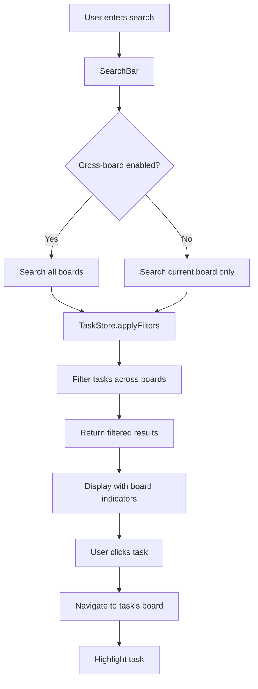

# Design Document

## Overview

The cross-board search enhancement will modify the existing search functionality to operate across all boards while maintaining the current user experience for single-board operations. The design introduces a search scope toggle, enhanced task display with board indicators, and navigation capabilities to jump between boards from search results.

The solution leverages the existing Zustand store architecture and React component structure, extending the current `TaskFilters` interface and search logic to support cross-board operations while maintaining backward compatibility.

## Architecture

### Core Components Modified

1. **SearchBar Component** (`src/components/SearchBar.tsx`)
   - Add search scope toggle (current board vs all boards)
   - Persist search scope preference in settings
   - Update UI to indicate current search scope

2. **Task Store** (`src/lib/stores/taskStore.ts`)
   - Modify filtering logic to support cross-board search
   - Add search scope state management
   - Update `applyFilters` function to handle cross-board scenarios

3. **TaskCard Component** (`src/components/kanban/TaskCard.tsx`)
   - Add board indicator when displaying cross-board results
   - Implement click-to-navigate functionality
   - Add visual distinction for current vs other boards

4. **BoardView Component** (`src/components/BoardView.tsx`)
   - Handle cross-board search result display
   - Implement task highlighting when navigating from search
   - Manage search state clearing on board navigation

### Data Flow



## Components and Interfaces

### Enhanced TaskFilters Interface

```typescript
export interface TaskFilters {
  search: string;
  status?: Task['status'];
  priority?: Task['priority'];
  tags: string[];
  boardId?: string; // When null/undefined, search all boards
  crossBoardSearch: boolean; // New field to control search scope
  dateRange?: {
    start: Date;
    end: Date;
  };
}
```

### New SearchScope Type

```typescript
export type SearchScope = 'current-board' | 'all-boards';

export interface SearchState {
  scope: SearchScope;
  highlightedTaskId?: string; // For task highlighting after navigation
}
```

### Enhanced Settings Interface

```typescript
export interface Settings {
  // ... existing fields
  searchPreferences: {
    defaultScope: SearchScope;
    rememberScope: boolean;
  };
}
```

### Board Indicator Component

```typescript
interface BoardIndicatorProps {
  board: Board;
  isCurrentBoard: boolean;
  size?: 'sm' | 'md';
  showName?: boolean;
}

export function BoardIndicator({ 
  board, 
  isCurrentBoard, 
  size = 'sm', 
  showName = true 
}: BoardIndicatorProps) {
  // Renders board color dot + name with appropriate styling
}
```

### Cross-Board Task Card

```typescript
interface CrossBoardTaskCardProps extends TaskCardProps {
  showBoardIndicator: boolean;
  onNavigateToBoard?: (boardId: string, taskId: string) => void;
}
```

## Data Models

### Task Display Model (for cross-board results)

```typescript
interface TaskWithBoard extends Task {
  board: Board; // Populated board information for display
  isFromCurrentBoard: boolean; // Quick reference for styling
}
```

### Search Result Model

```typescript
interface SearchResult {
  tasks: TaskWithBoard[];
  totalCount: number;
  boardCounts: Record<string, number>; // Tasks per board
  scope: SearchScope;
}
```

## Error Handling

### Search Performance
- Implement debouncing (300ms) for search input to prevent excessive filtering
- Add loading states for cross-board searches
- Graceful degradation if board data is unavailable

### Navigation Errors
- Handle cases where target board no longer exists
- Fallback to current board if navigation fails
- Show user-friendly error messages

### Data Consistency
- Ensure board information is available when displaying cross-board results
- Handle race conditions between board updates and search results
- Validate board access permissions (future-proofing)

## Testing Strategy

### Unit Tests

1. **TaskStore Tests**
   - Test cross-board filtering logic
   - Verify search scope state management
   - Test filter combinations with cross-board search

2. **SearchBar Tests**
   - Test scope toggle functionality
   - Verify preference persistence
   - Test search input debouncing

3. **TaskCard Tests**
   - Test board indicator display
   - Verify navigation callback execution
   - Test visual distinction between current/other boards

### Integration Tests

1. **Search Flow Tests**
   - End-to-end search across multiple boards
   - Navigation from search results to boards
   - Filter combinations with cross-board search

2. **Performance Tests**
   - Search performance with large datasets
   - Memory usage during cross-board operations
   - UI responsiveness during search

### Visual Tests

1. **Board Indicator Display**
   - Correct board colors and names
   - Proper sizing and positioning
   - Accessibility compliance

2. **Search Result Layout**
   - Task cards with board indicators
   - Visual hierarchy and spacing
   - Responsive design across screen sizes

## Implementation Phases

### Phase 1: Core Infrastructure
- Extend TaskFilters interface
- Modify task store filtering logic
- Add search scope state management

### Phase 2: UI Components
- Create BoardIndicator component
- Enhance SearchBar with scope toggle
- Update TaskCard for cross-board display

### Phase 3: Navigation & UX
- Implement board navigation from search
- Add task highlighting functionality
- Integrate preference persistence

### Phase 4: Polish & Performance
- Optimize search performance
- Add loading states and error handling
- Implement comprehensive testing

## Visual Design Specifications

### Board Indicator Design
- **Small size (sm)**: 12px color dot + truncated board name (max 15 chars)
- **Medium size (md)**: 16px color dot + full board name
- **Current board**: Subtle background highlight, normal text weight
- **Other boards**: No background, slightly muted text

### Search Scope Toggle
- Toggle switch in search bar filter popover
- Clear labeling: "Search all boards" vs "Current board only"
- Visual indicator in search bar when cross-board is active
- Persistent state with user preference storage

### Cross-Board Task Cards
- Board indicator positioned in top-right corner of task card
- Subtle visual treatment to not overwhelm task content
- Hover states for board indicators showing full board information
- Click affordance for navigation (cursor pointer, subtle animation)

### Search Results Layout
- Maintain existing kanban column layout for current board results
- For cross-board results, consider mixed-board columns or board-grouped sections
- Clear visual separation between current board and other board results
- Consistent spacing and alignment with existing design system